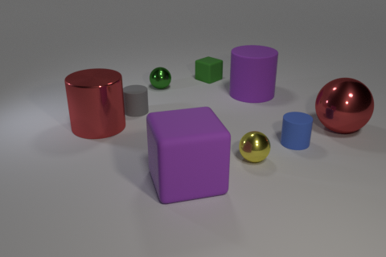
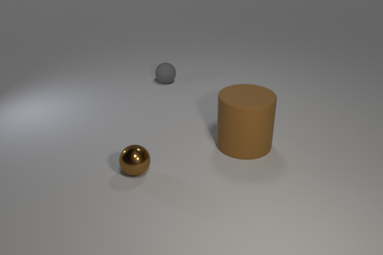
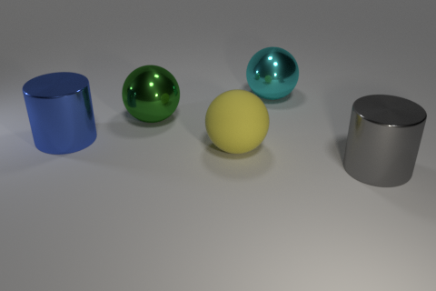
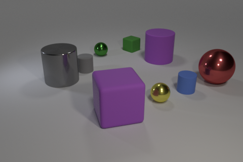
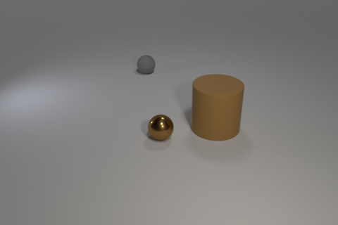
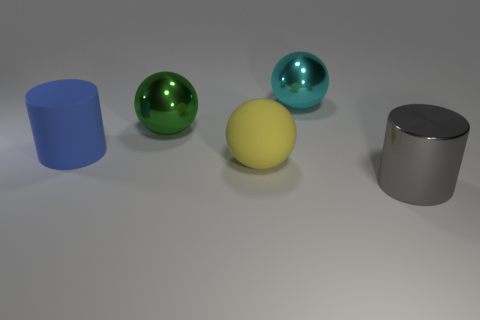

# CLEVR Dataset Generation with "Action Identification"

This is the code developed based on the original [CLEVR dataset](http://cs.stanford.edu/people/jcjohns/clevr/) generation code. The original non-action-based dataset generation mechanism is as described in the [paper](https://github.com/facebookresearch/clevr-iep).

You can use this code to render synthetic images and compositional questions for those images, like this:

<div align="center">
  
</div>

**Q:** How many small spheres are there? <br>
**A:** 2

**Q:**  What number of cubes are small things or red metal objects? <br>
**A:**  2

**Q:** Does the metal sphere have the same color as the metal cylinder? <br>
**A:** Yes

**Q:** Are there more small cylinders than metal things? <br>
**A:** No

**Q:**  There is a cylinder that is on the right side of the large yellow object behind the blue ball; is there a shiny cube in front of it? <br>
**A:**  Yes

If you find this code useful in your research, please cite the original paper

```
@inproceedings{johnson2017clevr,
  title={CLEVR: A Diagnostic Dataset for Compositional Language and Elementary Visual Reasoning},
  author={Johnson, Justin and Hariharan, Bharath and van der Maaten, Laurens
          and Fei-Fei, Li and Zitnick, C Lawrence and Girshick, Ross},
  booktitle={CVPR},
  year={2017}
}
```
and my work 
```
@inproceedings{johnson2017clevr,
  title={},
  author={},
  booktitle={},
  year={2018}
}
```
All code was developed and tested on Ubuntu 16.04.

## Step 1: Generating Images
### Regular Images
First we render synthetic images using [Blender](https://www.blender.org/), outputting both rendered images as well as a JSON file containing ground-truth scene information for each image.

Blender ships with its own installation of Python which is used to execute scripts that interact with Blender; you'll need to add the `image_generation` directory to Python path of Blender's bundled Python. The easiest way to do this is by adding a `.pth` file to the `site-packages` directory of Blender's Python, like this:

```bash
echo $PWD/image_generation >> $BLENDER/$VERSION/python/lib/python3.5/site-packages/clevr.pth
```

where `$BLENDER` is the directory where Blender is installed and `$VERSION` is your Blender version; for example on OSX you might run:

```bash
echo $PWD/image_generation >> /Applications/blender/blender.app/Contents/Resources/2.78/python/lib/python3.5/site-packages/clevr.pth
```

You can then render some regular CLEVR images like this:

```bash
cd image_generation
blender --background --python render_images.py -- --num_images 10
```

On OSX the `blender` binary is located inside the blender.app directory; for convenience you may want to
add the following alias to your `~/.bash_profile` file:

```bash
alias blender='/Applications/blender/blender.app/Contents/MacOS/blender'
```

If you have an NVIDIA GPU with CUDA installed then you can use the GPU to accelerate rendering like this:

```bash
blender --background --python render_images.py -- --num_images 10 --use_gpu 1
```

After this command terminates you should have ten freshly rendered images stored in `output/images` like these:

<div align="center">
  
  
  
  <br>
  
  
  
</div>

The file `output/CLEVR_scenes.json` will contain ground-truth scene information for all newly rendered images.

### Action Images

Similar to regular images, you can render action-based CLEVR images like this:

```bash
cd image_generation
blender --background --python render_images.py -- --num_images 10 --action
```
After this command terminates you should have ten freshly rendered images stored in `output/images` like these:

<div align="center">
  
  
  
  <br>
  
  
  
</div>

The file `output/CLEVR_cb_scenes.json` will contain ground-truth scene information for all newly rendered images.

You can find [more details about image rendering here](image_generation/README.md).

## Step 2: Generating Questions
Next we generate questions, functional programs, and answers for the rendered images generated in the previous step.
This step takes as input the single JSON file containing all ground-truth scene information, and outputs a JSON file 
containing questions, answers, and functional programs for the questions in a single JSON file.

You can generate questions like this for regular images:

```bash
cd question_generation
python generate_questions.py
```
The file `output/CLEVR_questions.json` will then contain questions for the generated images.

You can generate questions for action-based images:

```bash
cd question_generation
python generate_questions.py --action 1 
```

The file `output/CLEVR_action_questions.json` will then contain questions for the generated images.

You can [find more details about question generation here](question_generation/README.md).
